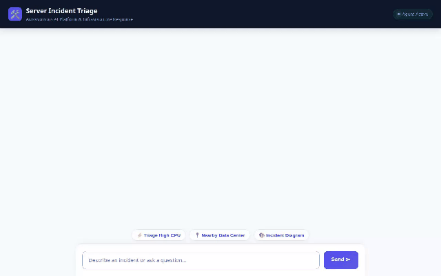

# Server Incident Triage Agent



An autonomous IT operations and incident triage assistant built with **Google Agent Development Kit (ADK)**, **Vertex AI Gemini & Omni Models**, **Google Cloud Firestore**, **Google Cloud Storage**, **Google Maps APIs**, and **A2UI v0.8**.

---

## 🌟 Capabilities & Features

### 1. 🧠 Persistent Memory Bank (Firestore)
- **Session Memory Persistence**: Stores and retrieves persistent user rules, preferences, and context across sessions using Google Cloud Firestore (`user_allergies` collection).
- **Tools**: `save_user_allergy`, `get_user_allergies`, `load_memory`, `preload_memory_tool`.

### 2. 📋 Incident Management System (Firestore)
- **Real-Time Ticket Management**: Performs CRUD operations on server incident tickets directly in Google Cloud Firestore (`incidents` collection).
- **Tools**: `create_incident`, `get_incidents`, `update_incident_status`.

### 3. 🎥 Multimodal Video Generation (Google Omni Model)
- **Infrastructure Video Generation**: Generates incident simulation video clips using Google's Omni model (`gemini-omni-flash-preview`) in the `global` region.
- **Dual Pipeline Output**: Saves generated video clips to the Playground Artifacts panel (`tool_context.save_artifact`) and streams raw video bytes directly to Google Cloud Storage.
- **Tool**: `generate_server_video`.

### 4. 🎨 Architecture Diagram Generation
- **Diagram Synthesis**: Generates technical server architecture diagrams using `gemini-3.1-flash-lite-image` in the `global` region.
- **Direct Cloud Upload**: Uploads generated diagram images directly to Google Cloud Storage and returns public HTTPS URLs for inline rendering.
- **Tool**: `generate_server_diagram`.

### 5. ☁️ Google Cloud Storage Integration
- **Media Asset Bucket**: Wired directly to Google Cloud Storage (`server-incident-triage-assets-5c5faf`) for public hosting of generated diagrams and videos.

### 6. 🗺️ Location Intelligence & Maps
- **Geocoding API**: Converts street addresses and facility locations into latitude/longitude coordinates (`geocode_address`).
- **Places API (New)**: Searches for nearby facilities, data centers, or services within a specified radius (`search_nearby_places`).

### 7. 🔍 Network Diagnostics & Public DNS
- **Google Public DNS**: Resolves domain names and checks DNS record status (A, AAAA, MX, TXT) via Google Public DNS (`resolve_domain_dns`).
- **Endpoint Health Checker**: Measures round-trip latency and HTTP status for web service endpoints (`ping_service_endpoint`).

### 8. 📊 Telemetry Diagnostics & Systems Monitoring
- **Host Health Monitoring**: Reports real-time CPU utilization, RAM usage, free disk space, and system uptime (`check_server_health`).
- **Log Diagnostics**: Filters and searches system log traces by severity level (`query_server_logs`).

### 9. 🎨 Structured A2UI Interface (v0.8)
- **Dynamic UI Rendering**: Leverages `A2uiSchemaManager` (v0.8) and `BasicCatalog` to render structured UI cards, status badges, and inline images.

---

## 🔮 Planned / Future Capabilities

The following features were outlined in initial design concepts but are **planned, not yet implemented**:
- **Automated PagerDuty & Slack Escalation**: *Planned, not yet implemented.*
- **Kubernetes Pod Auto-Remediation**: *Planned, not yet implemented.*

---

## 🛠️ Local Setup & Run Instructions

### Prerequisites
- Python 3.10+
- `uv` package manager or `pip`
- Google Cloud credentials (`gcloud auth application-default login`)

### 1. Install Dependencies
```bash
pip install -r requirements.txt
```

### 2. Configure Environment Variables
Create a `.env` file in the root directory:
```bash
GOOGLE_CLOUD_PROJECT=your-gcp-project-id
GOOGLE_MAPS_API_KEY=your-google-maps-api-key
```

### 3. Run the Agent Playground Locally
To run the ADK Playground CLI interface:
```bash
agents-cli playground
```

### 4. Run the Web Frontend Locally
To run the custom web frontend proxy and chat UI:
```bash
cd frontend
pip install -r requirements.txt
python main.py
```
Open a browser and navigate to the local server port printed in the terminal output.

---

## 🏗️ Project Structure

```
server-incident-triage/
├── app/
│   ├── __init__.py
│   ├── a2ui_utils.py       # A2UI response formatter and callbacks
│   └── agent.py            # Main ADK Agent declaration and tool definitions
├── frontend/
│   ├── main.py             # FastAPI proxy server for remote Agent Engine
│   ├── requirements.txt    # Frontend dependencies
│   └── static/
│       └── index.html      # Custom chat UI with A2UI renderer
├── .env                    # Local environment variables
├── agents-cli-manifest.yaml # Agent Platform deployment manifest
├── agent_demo.gif          # Recorded demo video (looping GIF)
├── requirements.txt        # Backend dependencies
└── README.md               # Project documentation
```
